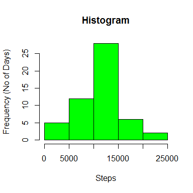
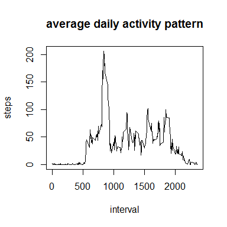
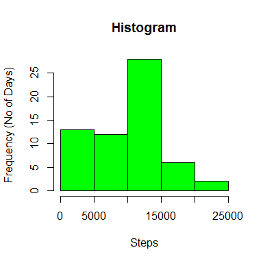
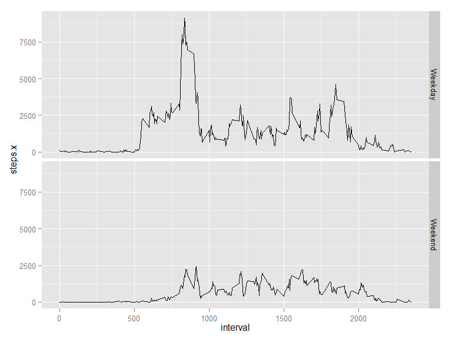

# Reproducible Research: Peer Assessment 1

Thank you for reading my markdown file for the first Peer Assessment in Reproducible Research. 

## Loading and preprocessing the data
First we load "activity.csv" into dataframe 'activity', which contains three columns (steps, date, and interval). I load pander, which I have not used before, because it allows me to set the diplay
digits easiy. I load ggplot2 for the final two-panel chart. 

```r
library(pander)
library(ggplot2)
panderOptions('digits',2)
activity <- read.csv("activity.csv", stringsAsFactors = FALSE)
activity$date <- as.Date(activity$date)
```


## What is mean total number of steps taken per day?
I could use median(), but median is just a special case of the 50th quantile, so I used that for fun! I tried different bin values but ultimately settled on 10 bins (the default returns 5 bins).


```r
steps.perday <- aggregate(activity["steps"], by=activity["date"],FUN="sum")
steps.perday.median <- quantile(steps.perday$steps, probs = 0.5, na.rm=TRUE)
steps.perday.mean <-mean(steps.perday$steps, na.rm=TRUE)
hist(steps.perday$steps, 10, freq=TRUE, main = "Histogram (NAs not treated)", 
     ylab = "Frequency (No of Days)", xlab="Steps", col="green")
```

 

In regard to the total number of steps per day over the period:

* The __mean__ daily total is 10766.19 and 
* The __median__ daily total is 10765.00

## What is the average daily activity pattern?
Now we consider the pattern over an average day. There are 288 5-minute intervals in each day (288 = 24 hours * 60 minutes / 5 minutes). For each 5-minute interval, this plots the average across all days. 


```r
steps.perinterval <- aggregate(activity["steps"], by=activity["interval"],
                               FUN="mean", na.rm = TRUE)
plot(steps.perinterval, type="l", main="average daily activity pattern")
```

 

```r
    interval.maxsteps <- max(steps.perinterval$steps)
interval.max <- steps.perinterval$interval[steps.perinterval$steps == max(steps.perinterval$steps)]
```

On average across all the days in the datase, the 5-minute interval **which constains the maximum number of steps** is interval 835 which contains (on average) 206.17 steps.

## Imputing missing values
I used a very simple strategy to replace missing values (NAs): the NA is replaced by the average number of steps for that interval. For example, interval = 0 (the first interval) has an average of 1.717 steps, such that it will replace all NAs the occur during interval = 0. 


```r
number.nas <- sum(is.na(activity$steps))
df.merged <- merge(activity, steps.perinterval, by.x= "interval", by.y= "interval", all.x = TRUE)
suppressWarnings(df.merged$steps.x[is.na(df.merged$steps.x)] <- df.merged$steps.y)
index <- with(df.merged, order(date, interval))
new.table <- df.merged[index,]

newsteps.perday <- aggregate(new.table["steps.x"], by=new.table["date"],FUN="sum")
hist(newsteps.perday$steps, 10, freq=TRUE, main = "Histogram (NAs replaced)", 
     ylab = "Frequency (No of Days)", xlab="Steps", col="green")
```

 

```r
newsteps.perday.median <- quantile(newsteps.perday$steps, probs = 0.5, na.rm=TRUE)
newsteps.perday.mean <- mean(newsteps.perday$steps, na.rm=TRUE)
```

In regard to the impact of replacing missing values, we can see:

* Becauase NAs previously did not contribut to the histogram, and the replacing values generally occur in the lowest bin, the significant negative skew is introduced
* The mean and median decrease slightly

In regard to the total number of steps per day over the period:

* The mean daily total is 9371.44 and 
* The median daily total is 10395.00

## Are there differences in activity patterns between weekdays and weekends?
Finally, we essentially parse the above "average daily activity pattern" into two components: weekday average versus weekend average (for each 5-minute interval). We can observe:

* At both tails (1 to 500 and 2000 to 2400), weekends and weekdays are similar: little activity during sleep/rest
* At 500 to 1000, there is _much greater_ activity during weekdays
* At 1000 to 1500, there is slightly greater activity during weekdays
* At 1500 to 2000, there is greater activity during weekdays.


```r
new.table$weekday <- weekdays(new.table$date)
v.weekdays <- c("Monday", "Tuesday", "Wednesday", "Thursday", "Friday")
v.weekend <- c("Saturday", "Sunday")
new.table$weekday[new.table$weekday %in% v.weekdays] <- "Weekday"
new.table$weekday[new.table$weekday %in% v.weekend] <- "Weekend"
new.table$weekday <- factor(new.table$weekday)
n.steps.perday <- aggregate(new.table["steps.x"], by=new.table[c("interval","weekday")],FUN="sum")
ggplot(n.steps.perday, aes(x=interval, y=steps.x)) +
    geom_line() + 
    facet_grid(weekday ~ .)
```

 

