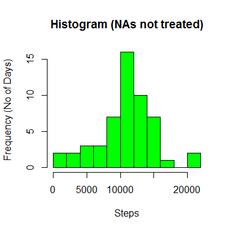
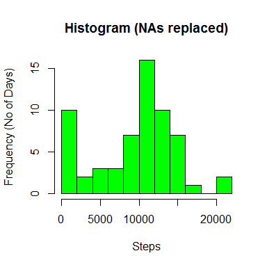

# Reproducible Research: Peer Assessment 1

This is the introduction to my file

## Loading and preprocessing the data

```r
library(pander)
library(ggplot2)
panderOptions('digits',2)
activity <- read.csv("activity.csv", stringsAsFactors = FALSE)
activity$date <- as.Date(activity$date)
```


## What is mean total number of steps taken per day?

```r
steps.perday <- aggregate(activity["steps"], by=activity["date"],FUN="sum")
steps.perday.median <- quantile(steps.perday$steps, probs = 0.5, na.rm=TRUE)
steps.perday.mean <-mean(steps.perday$steps, na.rm=TRUE)
hist(steps.perday$steps, freq=TRUE, main = "Histogram", 
     ylab = "Frequency (No of Days)", xlab="Steps", col="green")
```

 

In regard to the total number of steps per day over the period:

* The mean daily total is 10766.19 and 
* The median daily total is 10765.00

## What is the average daily activity pattern?

```r
steps.perinterval <- aggregate(activity["steps"], by=activity["interval"],
                               FUN="mean", na.rm = TRUE)
plot(steps.perinterval, type="l")
```

 

```r
interval.maxsteps <- max(steps.perinterval$steps)
interval.max <- steps.perinterval$interval[steps.perinterval$steps == max(steps.perinterval$steps)]
```

The 5-minute interval, on average across all the days in the dataset, is the 835 which contains (on average) 206.17 steps.

## Imputing missing values


```r
number.nas <- sum(is.na(activity$steps))
df.merged <- merge(activity, steps.perinterval, by.x= "interval", by.y= "interval", all.x = TRUE)
df.merged$steps.x[is.na(df.merged$steps.x)] <- df.merged$steps.y
```

```
## Warning: number of items to replace is not a multiple of replacement
## length
```

```r
index <- with(df.merged, order(date, interval))
new.table <- df.merged[index,]

newsteps.perday <- aggregate(new.table["steps.x"], by=new.table["date"],FUN="sum")
hist(newsteps.perday$steps, freq=TRUE, main = "Histogram", ylab = "Frequency (No of Days)", xlab="Steps", col="green")
```

 

```r
newsteps.perday.median <- quantile(newsteps.perday$steps, probs = 0.5, na.rm=TRUE)
newsteps.perday.mean <- mean(newsteps.perday$steps, na.rm=TRUE)
```


In regard to the total number of steps per day over the period:

* The mean daily total is 9371.44 and 
* The median daily total is 10395.00

## Are there differences in activity patterns between weekdays and weekends?


```r
new.table$weekday <- weekdays(new.table$date)
v.weekdays <- c("Monday", "Tuesday", "Wednesday", "Thursday", "Friday")
v.weekend <- c("Saturday", "Sunday")
new.table$weekday[new.table$weekday %in% v.weekdays] <- "Weekday"
new.table$weekday[new.table$weekday %in% v.weekend] <- "Weekend"
new.table$weekday <- factor(new.table$weekday)
n.steps.perday <- aggregate(new.table["steps.x"], by=new.table[c("interval","weekday")],FUN="sum")
ggplot(n.steps.perday, aes(x=interval, y=steps.x)) +
    geom_line() + 
    facet_grid(weekday ~ .)
```

 

